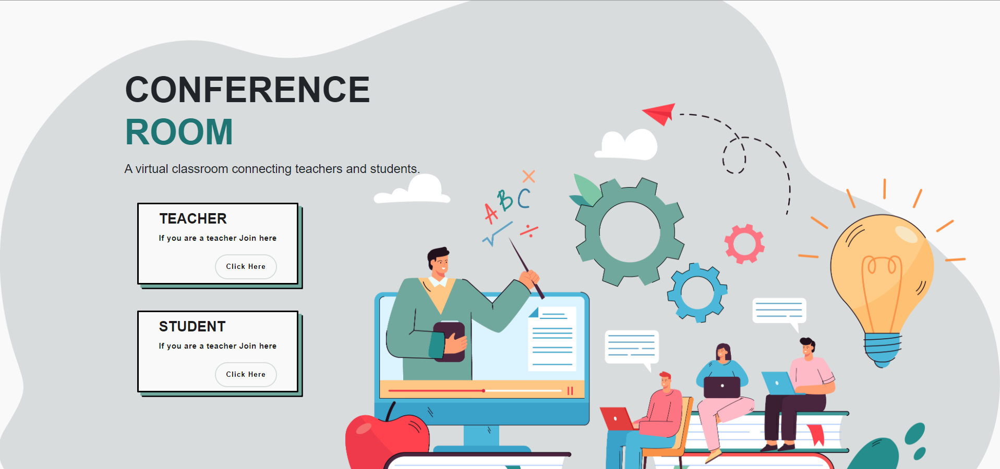

# 💻 Conference Room
A web-based platform connecting teachers and students.

## ℹ About
Conference Room is a suite of online tools that allows teachers to set assignments, have work submitted by students, to mark, and to return grades back to students. Students can also submit their work and join their classes directly from here.




## 🎇 Features
1. ✔️ Login and signup via
    - ✔️ Username & Password
   - ✔️ Gmail Sync (Login with Gmail Option).
    - 
2. ✔️ Home Page showing the list of all the subjects of the logged in student
       
3. ✔️ Assignment Page ( Showing the list of assignments done till now as well as the assignments to
be done)
       
       
4. ✔️Test Page ( Showing the list of past test results as well as upcoming tests)
 
 
## ⚙ Technology Stack
`Backend` : Flask <br>
`Database`: MySQL <br>
`Frontend`: CSS, Jinja, HTML, Bootstrap, Javascript  <br>
`Hosting` : Pythonanywhere <br>
`Additional` : Google Authentication <br>
**We have made custom API to make API calls for fetching data from the Database.**

## 🔧 Installation

A step by step series of examples that tell you how to get a development env running.<br>
**STEP 1** : Clone the repository
```
https://github.com/Conference-Room/conference_room
```

We recommend to use `virtualenv` for development:
**STEP 2** : Create Virtual Environment

```
pip install virtualenv
cd conference_room
python -m venv venv
cd venv\Scripts
 .\activate
```

**STEP 3** : Install the python dependencies 

- Go back in your conference_room folder using cd.. and install the dependencies on the virtual environment
```
pip install -r requirements.txt
```

**STEP : 4**
- Start the web application 🥳
```
python app.py
```

<!-- ### Some Salient Features
**Features for Teachers**
 * Teachers can upload assigment and grade the assignments
 * Can see other students enrolled       
 * Can create new class
 * Preview & Route in Enrolled class
 * Can view the work of any class
 * Teachers can annouce anything to the whole class at once
 * Teachers can create a meet link

**Features for Students**
* Students can upload the work done and check marks provided by teacher
* See other friends and teachers             
* Store work as submission         
* Students can enroll into a new classroom
* Preview & Route in Enrolled class
* Can view the work of any class
* Students can ask their doubts directly from the teacher
* Student can directly join the classes via the link -->


